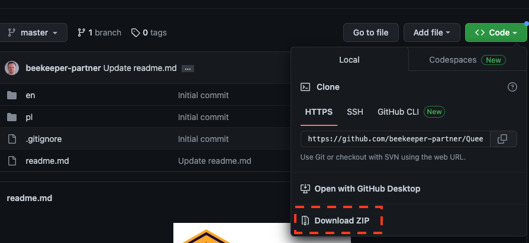

<div align="center"> 

  
# Beekeeper's Partner - Queen Breeding app <br/>translations 
</div>

## What this is about? 
If you want to help us translate the app https://hodowca.partnerpszczelarza.pl into your language, we will welcome any help.

We know that beekeeping language can be pretty specific in different European regions so any translation support will be much appreciated.

## How to start? 
Currently, there are English & Polish translations available in our application. If you want to help us, you have at least two options: 
### I'm a github user and I know git
You should already know what to do. Just clone or fork the repository, and when you're done - send us a pull request. For specific details, please see the next section about 'How to edit translations', 

We can also add you as an contributor to this repository, so let us know if that option work for you as well. 

### I'm not a github user 
You can download the whole repository as a ZIP file (start here: https://github.com/beekeeper-partner/Queen-Breeders-App---Translations). Go to Code -> Local -> Download ZIP.


After you're done with translations - just send them via email to [hello@partnerpszczelarza.pl](mailto:hello@partnerpszczelarza.pl).

## How to edit translations 
### Structure
Each language has its folder in this repository, but the default/fallback language is English in `en` folder. 

Folders are named with alpha-2 ISO country code; if you are not familiar with the code of your country, please check https://www.iban.com/country-codes for reference. 

#### Starting new language
If there is no existing folder with the code of your country - the best way to start is to duplicate the English `en` folder, rename it to your country code and proceed with translations. 

#### Translations 
Each country folder is divided into smaller chunks of translations, which we will call modules. 

Each translation is represented by a key and value: 
```phpt
    'nextDayLabel' => 'Next day',
```
Where `nextDayLabel` is a key and `Next day` is called value.
Please do not change the key during translations, as it is the link to proper translation in our application. Change only the **value** in each file. 

You can use any text editor for the translations, but please try to keep the same structure of the file as much as possible.

## License
The translations of our applications (and only those) are distributed under The MIT License.
